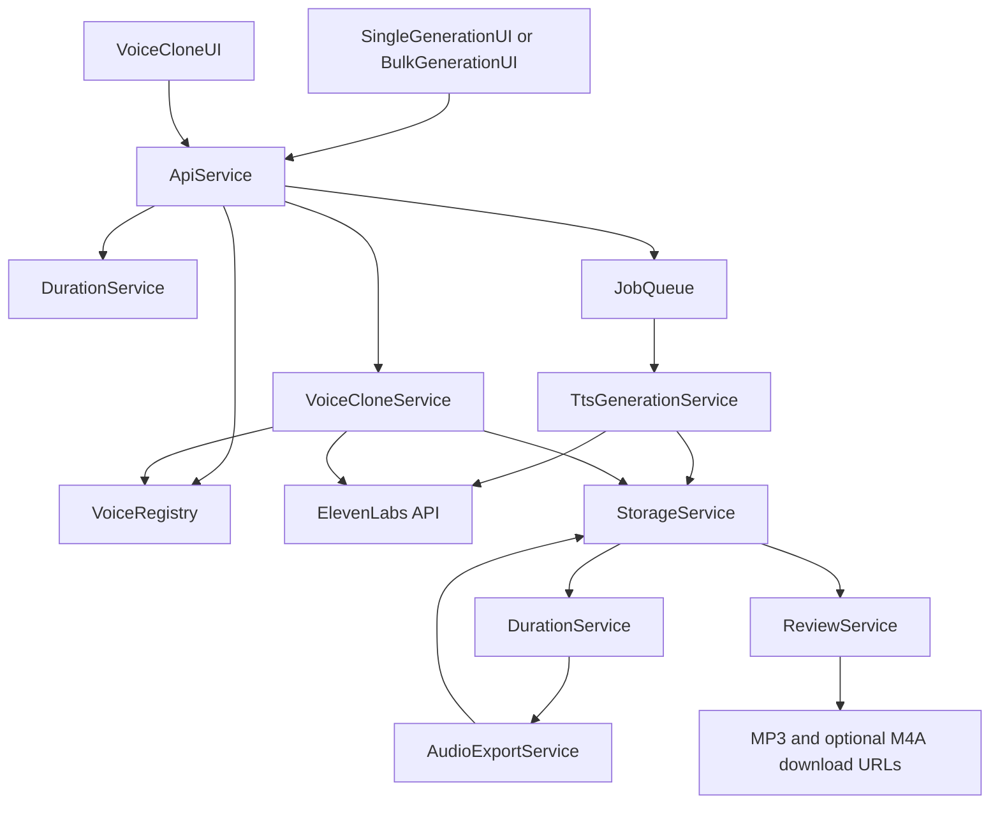

# Architectural Blueprint

## 1. Core Objective

Build an internal ElevenLabs text-to-speech MVP that lets operators create, preview, store, and download generated MP3 audio, with optional LinkedIn-ready AAC mono `.m4a` export, while enforcing voice consent, auditable voice reuse, duration warnings, and human review before downstream outreach use.

## 2. System Scope and Boundaries

### In Scope

- Single text-to-speech generation.
- ElevenLabs library/Voice Design voice use.
- ElevenLabs Instant Voice Clone from uploaded audio.
- ElevenLabs Instant Voice Clone from live browser recording.
- Persistent approved voice registry.
- Speech context presets.
- Duration estimate and warning state.
- Generated MP3 storage and preview.
- Optional `.m4a` export using AAC mono and 60-second cap.
- Excel `.xlsx` bulk upload and result workbook.
- Generation API for future internal tools.
- Human review status logging.

### Out of Scope

- LinkedIn sending or message automation.
- Unipile, Prosp, or other third-party sending providers.
- CRM integration.
- Paid lead enrichment.
- Professional Voice Cloning as the default workflow.
- Automated outreach.

## 3. Core System Components

| Component Name | Single Responsibility |
|---|---|
| **SingleGenerationUI** | Collect single-generation inputs, show warnings, preview audio, and expose downloads. |
| **VoiceCloneUI** | Collect clone-source audio and consent metadata for approved voice creation. |
| **BulkGenerationUI** | Upload workbooks, display batch progress, and download result workbooks/files. |
| **ApiService** | Expose HTTP endpoints and enforce request/response contracts. |
| **VoiceRegistry** | Persist approved voices, consent metadata, ElevenLabs voice IDs, and voice availability state. |
| **VoiceCloneService** | Validate clone samples and create ElevenLabs Instant Voice Clones. |
| **TtsGenerationService** | Call ElevenLabs Text to Speech and create MP3 source audio. |
| **DurationService** | Estimate text duration, measure generated audio duration, and produce yellow/red warning states. |
| **AudioExportService** | Convert generated MP3 files into AAC mono `.m4a` exports when requested. |
| **BulkWorkbookService** | Parse, validate, and write `.xlsx` bulk-generation workbooks. |
| **JobQueue** | Create idempotent jobs, run batch rows, retry provider-safe failures, and expose status. |
| **StorageService** | Store voice artifacts, generated audio, registry JSON, and downloadable file URLs. |
| **ReviewService** | Record human review status and prevent silent use of risky outputs. |

## 4. High-Level Data Flow

## 5. Key Integration Points

- **ApiService <-> ElevenLabs API via TtsGenerationService**: HTTPS requests using `ELEVENLABS_API_KEY`; request includes `voice_id`, text, model, output format, and voice settings; response is binary audio.
- **ApiService <-> VoiceCloneService**: Multipart upload for audio samples plus consent metadata; returns an internal voice record after ElevenLabs returns a clone voice ID.
- **BulkGenerationUI <-> BulkWorkbookService**: `.xlsx` upload with required `tts_requests` worksheet and deterministic column validation.
- **JobQueue <-> StorageService**: Job output files written under `data/generated_audio/`; voice artifacts under `data/voices/`.
- **DurationService <-> StorageService**: Measures stored MP3 duration after generation and updates job warning state.
- **AudioExportService <-> StorageService**: Converts stored MP3 to `.m4a` using ffmpeg and stores the export URL.
- **ReviewService <-> ApiService**: Records reviewer status and approval metadata without triggering any sending action.
